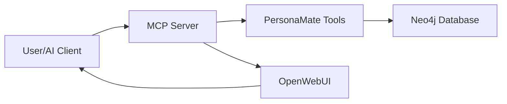

# PersonaMate Documentation

Welcome to the PersonaMate documentation! PersonaMate is a personal knowledge graph assistant that uses AI and Model Context Protocol (MCP) to manage personal contact data and relationships.


[](https://codecov.io/gh/enrodrigu/PersonaMate)

## 🚀 Quick Links

### :material-rocket-launch: Quick Start
Get PersonaMate running in minutes with our automated deployment script.

**[→ Get Started](quickstart.md)**

---

### :material-docker: Deployment
Comprehensive deployment guide with troubleshooting and advanced configuration.

**[→ Deploy](deployment.md)**

---

### :material-code-braces: Contributing
Learn how to contribute to PersonaMate with our developer guide.

**[→ Contribute](contributing.md)**

---

### :material-connection: MCP Protocol
Understand the Model Context Protocol interface - tools, resources, and prompts.

**[→ Learn More](mcp.md)**

## ✨ Key Features

- 🤖 **MCP Protocol**: Standard interface for AI assistants
- 💬 **OpenWebUI**: Modern chat interface (optional)
- 🕸️ **Neo4j Graph**: Powerful relationship modeling
- 🐳 **Docker**: Easy deployment and scaling
- 🔧 **Modular Tools**: Extensible functionality
- ✅ **Comprehensive Tests**: 20 automated tests with CI/CD
- 📊 **Graph Visualization**: Neo4j Browser integration

## 🎯 What is PersonaMate?

PersonaMate is an intelligent personal knowledge graph that helps you:

- **Manage Contacts**: Store and retrieve person information with rich details
- **Track Relationships**: Model and visualize connections between people
- **Query Your Network**: Use natural language to explore your contact graph
- **Integrate with AI**: Expose data through Model Context Protocol for AI assistants

## 🏗️ Architecture Overview



**Core Components:**

- **MCP Server**: FastMCP-based server exposing tools and resources
- **Tools**: Modular operations for managing persons and relationships
- **Neo4j**: Graph database for storing entities and relationships
- **OpenWebUI**: Optional web interface for chat interactions

## 🚦 Getting Started

Choose your path:

=== "🎯 End User"

    Want to use PersonaMate right away?

    1. Install [Docker Desktop](https://www.docker.com/products/docker-desktop)
    2. Run the deployment script:
       ```bash
       # Windows
       .\deploy.ps1

       # Linux/macOS
       ./deploy.sh
       ```
    3. Choose "Full Stack" for complete setup
    4. Access OpenWebUI at http://localhost:3000

    **[→ Full Quick Start Guide](quickstart.md)**

=== "🔧 Developer"

    Want to contribute or customize?

    1. Clone the repository
    2. Install dependencies: `pip install -r requirements.txt`
    3. Set up pre-commit hooks: `pre-commit install`
    4. Start services: `docker compose up -d neo4j mcp`
    5. Run tests: `docker compose run --rm pytest pytest /app/test/python/ -v`

    **[→ Contributing Guide](contributing.md)**

=== "🚀 DevOps"

    Want to deploy in production?

    1. Review deployment options
    2. Configure environment variables
    3. Set up monitoring and backups
    4. Scale services as needed
    5. Configure reverse proxy for HTTPS

    **[→ Deployment Guide](deployment.md)**

## 📚 Documentation Structure

This documentation is organized into several sections:

### Getting Started
Learn how to install, deploy, and use PersonaMate with step-by-step guides.

- **[Quick Start](quickstart.md)**: Get running in 2 commands
- **[Deployment Guide](deployment.md)**: Full deployment with troubleshooting
- **[Docker Setup](docker.md)**: Docker-specific configuration

### Development
Contribute to PersonaMate and understand the development workflow.

- **[Contributing Guide](contributing.md)**: How to contribute code
- **[CI/CD Pipeline](workflows.md)**: Automated testing and deployment
- **[Testing](testing.md)**: Running and writing tests

### Architecture
Understand the technical design and implementation.

- **[MCP Protocol](mcp.md)**: Model Context Protocol specification
- **[Project Structure](structure.md)**: Code organization

### MCP Reference
Technical reference for PersonaMate's Model Context Protocol interface.

- **[Tools](mcp/tools.md)**: Available MCP tools
- **[Resources](mcp/resources.md)**: MCP resources and prompts

## 🆘 Need Help?

- 📖 Check the [Deployment Guide](deployment.md) for troubleshooting
- 💬 Open an [issue on GitHub](https://github.com/enrodrigu/PersonaMate/issues)
- 🔍 Search the documentation using the search bar above

## 📄 License

PersonaMate is open source software. See the [LICENSE](https://github.com/enrodrigu/PersonaMate/blob/main/LICENSE) file for details.

---

**Ready to get started?** Choose a guide above or jump to the [Quick Start →](quickstart.md)
