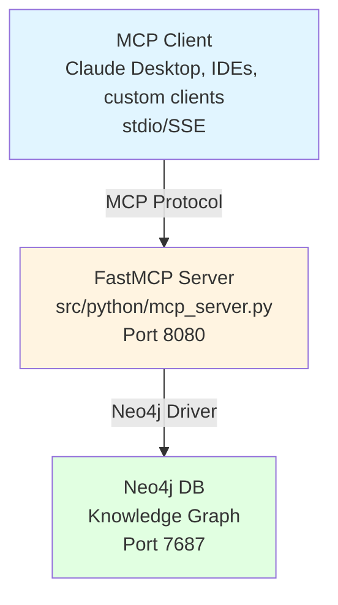

# PersonaMate MCP Documentation

PersonaMate implements the Model Context Protocol (MCP) using [FastMCP](https://github.com/jlowin/fastmcp), providing a standardized interface for AI assistants to interact with your personal knowledge graph.

## Overview

The MCP server (`src/python/mcp_server.py`) exposes:
- **Tools**: Callable functions for managing persons and relationships
- **Resources**: Read-only access to graph data
- **Prompts**: Reusable templates for common queries

## Architecture



## Connection Methods

### 1. Stdio Transport (recommended for Claude Desktop)

```json
{
  "mcpServers": {
    "personamate": {
      "command": "python",
      "args": ["/path/to/PersonaMate/src/python/mcp_server.py"],
      "env": {
        "NEO4J_URI": "bolt://localhost:7687",
        "NEO4J_USER": "neo4j",
        "NEO4J_PASSWORD": "your-password"
      }
    }
  }
}
```

### 2. SSE Transport (for HTTP clients)

Start the server:
```bash
python src/python/mcp_server.py --transport sse --port 8080
```

Connect via: `http://localhost:8080/sse`

## Tools

### fetch_person

Look up information about a person from the knowledge graph.

**Parameters:**
- `name` (string, required): The name of the person to look up

**Returns:** JSON string containing person data and related graph context

**Example:**
```python
result = await session.call_tool("fetch_person", {"name": "Alice Smith"})
```

### update_person

Update a person's information in the knowledge graph.

**Parameters:**
- `name` (string, required): The name of the person
- `field` (string, required): The field to update (e.g., 'age', 'email', 'location')
- `value` (string, required): The new value

**Returns:** Success message

**Example:**
```python
result = await session.call_tool("update_person", {
    "name": "Alice Smith",
    "field": "age",
    "value": "30"
})
```

### link_entities

Create a relationship between two entities in the knowledge graph.

**Parameters:**
- `element1` (string, required): Name of the first entity
- `type1` (string, required): Type of first entity (e.g., 'Person', 'Organization')
- `element2` (string, required): Name of the second entity
- `type2` (string, required): Type of second entity
- `linktype` (string, required): Relationship type (e.g., 'knows', 'likes', 'works_at')

**Returns:** Success message

**Example:**
```python
result = await session.call_tool("link_entities", {
    "element1": "Alice Smith",
    "type1": "Person",
    "element2": "Bob Johnson",
    "type2": "Person",
    "linktype": "knows"
})
```

### get_entity_context

Get rich context about an entity including its relationships.

**Parameters:**
- `name` (string, required): Name of the entity
- `entity_type` (string, optional): Type of entity (default: 'Person')
- `depth` (integer, optional): How many hops to traverse (default: 1)

**Returns:** JSON string with nodes, edges, and human-readable summary

**Example:**
```python
result = await session.call_tool("get_entity_context", {
    "name": "Alice Smith",
    "entity_type": "Person",
    "depth": 2
})
```

## Resources

Resources provide read-only access to graph data.

### graph://persons

List all persons in the knowledge graph.

**Returns:** Newline-separated list of person names

### graph://relationships

List all relationships in the knowledge graph (up to 100).

**Returns:** Formatted list of relationships in the format:
```
Name1 (Type1) -[RELATIONSHIP]-> Name2 (Type2)
```

### graph://stats

Get statistics about the knowledge graph.

**Returns:** Node counts by label and relationship counts by type

## Prompts

### person_lookup_prompt

Generate a comprehensive information lookup prompt for a person.

**Parameters:**
- `name` (string): Name of the person

### relationship_analysis_prompt

Generate a prompt for analyzing relationships between two people.

**Parameters:**
- `person1` (string): First person's name
- `person2` (string): Second person's name

## Error Handling

The MCP server handles errors gracefully:
- Invalid tool parameters return descriptive error messages
- Neo4j connection errors are logged and returned to the client
- All resources include error handling for database failures

## Example Client Usage

```python
from mcp import ClientSession, StdioServerParameters
from mcp.client.stdio import stdio_client

server_params = StdioServerParameters(
    command="python",
    args=["src/python/mcp_server.py"]
)

async with stdio_client(server_params) as (read, write):
    async with ClientSession(read, write) as session:
        await session.initialize()

        # Call a tool
        result = await session.call_tool("fetch_person", {"name": "Alice"})
        print(result.content[0].text)

        # Read a resource
        result = await session.read_resource("graph://stats")
        print(result.contents[0].text)
```

## Implementation Details

The MCP server is built using FastMCP, which provides:
- Automatic tool schema generation from type hints
- Built-in support for stdio and SSE transports
- Decorator-based API for defining tools, resources, and prompts
- Full MCP protocol compliance

Key files:
- `src/python/mcp_server.py`: Main MCP server implementation
- `src/python/tools/personalDataTool.py`: Person management tools
- `src/python/tools/linkingTool.py`: Relationship management tools
- `src/python/utils/neo4j_graph.py`: Neo4j database wrapper

## Security Considerations

- **Neo4j Credentials**: Store in environment variables, never commit to git
- **Network Access**: MCP server runs locally by default
- **Input Validation**: All tool parameters are validated by FastMCP
- **Resource Limits**: Relationship listings are limited to 100 entries

## Future Enhancements

Planned improvements:
- [ ] Add authentication for SSE transport
- [ ] Implement pagination for large result sets
- [ ] Add more entity types (Organizations, Projects, etc.)
- [ ] Support for file attachments and documents
- [ ] Advanced graph query tools (path finding, clustering)

## Support

For issues or questions:
- Review Neo4j logs if database connection fails
- Ensure all environment variables are set correctly
