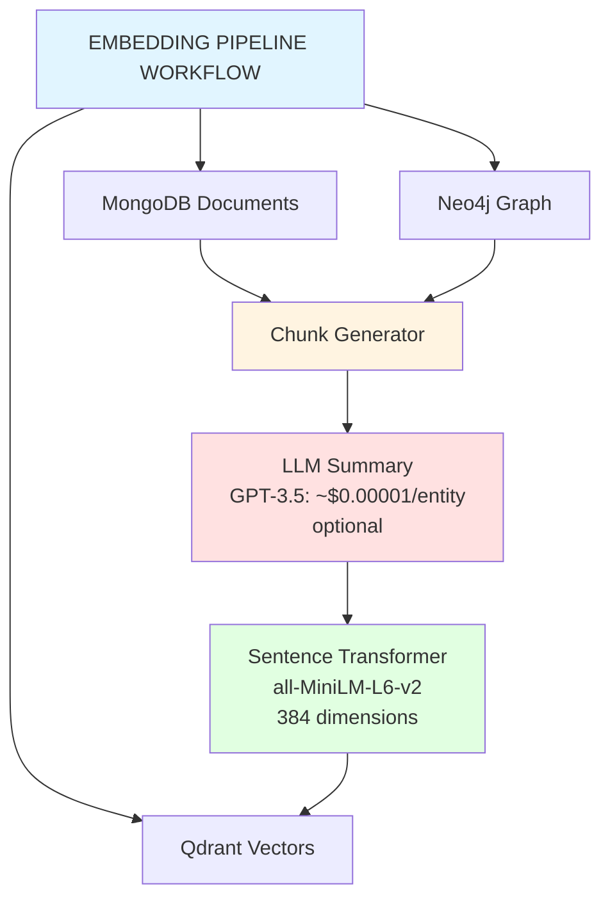

# Embedding Pipeline Documentation

## Overview

PersonaMate's embedding pipeline generates two types of embeddings for each entity:

1. **Global Embedding**: Represents the entire entity (complete summary)
2. **Attribute Embeddings**: One embedding per attribute or attribute group

This approach enables:
- ✅ Global semantic search (find similar entities)
- ✅ Fine-grained search (find specific skills, locations)
- ✅ Better accuracy than single embeddings
- ✅ Query flexibility

## Architecture



## Components

### 1. ChunkGenerator (`utils/chunk_generator.py`)

Generates text chunks from documents:

```python
from utils.chunk_generator import ChunkGenerator

# Generate all chunks for an entity
chunks = ChunkGenerator.generate_all_chunks(
    entity_id="person:alice",
    doc_id="doc_123",
    document=mongo_document,
    include_global=True,
    include_attributes=True,
    group_attributes=True  # Group related attributes
)
```

**Default attribute groups:**
- `identity`: name, title, role
- `skills`: skills, expertise, technologies
- `experience`: experience, positions, years_experience
- `education`: education, degrees, certifications
- `location`: location, city, country
- `contact`: email, phone, website
- `organization`: company, employer, team
- `projects`: projects, achievements

### 2. VectorStore (`utils/vector_store.py`)

Manages embeddings in Qdrant with chunk support:

```python
from utils.vector_store import VectorStore

vector = VectorStore.load()

# Add a chunk
vector.add_chunk_vector(
    chunk_id="chunk_uuid",
    entity_id="person:alice",
    doc_id="doc_123",
    chunk_type="attribute",  # or "global"
    text="Alice - Skills: Python, ML, TensorFlow",
    attribute_name="skills",
    metadata={"source": "structured_data"}
)

# Search by chunk type
results = vector.search_chunks(
    query="machine learning expert",
    chunk_type="attribute",  # Search only in attributes
    attribute_name="skills",  # Search only in skills
    limit=5
)
```

### 3. MongoStore (`utils/mongo_store.py`)

Extended document structure with `structured` support:

```python
from utils.mongo_store import MongoStore

mongo = MongoStore.load()

# Create a document with structured data
mongo.create_document(
    entity_id="person:alice",
    entity_type="Person",
    entity_name="Alice Johnson",
    structured={  # NEW: Structured attributes for chunking
        "name": "Alice Johnson",
        "title": "Data Scientist",
        "skills": ["Python", "ML", "TensorFlow"],
        "location": "San Francisco",
        "experience": "10 years"
    },
    text="Full text description...",  # NEW: Optional global text
    content={  # Unstructured content (legacy)
        "biography": "...",
        "notes": "..."
    }
)
```

### 4. EmbeddingPipeline (`utils/embedding_pipeline.py`)

Main orchestrator:

```python
from utils.embedding_pipeline import EmbeddingPipeline

pipeline = EmbeddingPipeline.load(use_llm_summaries=True)

# Add a new entity with automatic embeddings
entity_id = pipeline.add_new_entity(
    entity_type="Person",
    entity_name="Alice Johnson",
    structured_data={
        "title": "Data Scientist",
        "skills": ["Python", "ML"],
        "location": "SF"
    },
    text="Alice is a data scientist...",
    relationships=[("company:acme", "WORKS_AT")]
)

# Semantic search
results = pipeline.search_similar_entities(
    query="machine learning expert in San Francisco",
    limit=5
)
```

## Usage

### Installation

```bash
# Install dependencies
pip install langchain langchain-openai openai sentence-transformers

# Environment variables for LLM
export OPENAI_API_KEY="your-api-key"

# Start services
docker compose up -d mongodb neo4j qdrant
```

### Example 1: Add an Entity

```python
from utils.embedding_pipeline import EmbeddingPipeline

pipeline = EmbeddingPipeline.load(use_llm_summaries=True)

entity_id = pipeline.add_new_entity(
    entity_type="Person",
    entity_name="Bob Smith",
    structured_data={
        "name": "Bob Smith",
        "title": "Backend Engineer",
        "skills": ["Python", "Go", "Kubernetes"],
        "experience": "5 years",
        "location": "New York",
        "company": "Tech Corp"
    },
    content={
        "biography": "Backend engineer specializing in distributed systems..."
    },
    text="Bob is an experienced backend engineer..."
)

print(f"Created entity: {entity_id}")
```

### Example 2: Semantic Search

```python
# Global search
results = pipeline.search_similar_entities(
    query="kubernetes expert",
    limit=5
)

for result in results:
    print(f"{result['entity_name']}: {result['score']:.3f}")
    print(f"  Matched: {result['matched_attribute']}")
```

### Example 3: Search by Attribute

```python
# Search only in skills
from utils.vector_store import VectorStore

vector = VectorStore.load()

results = vector.search_chunks(
    query="machine learning deep learning",
    attribute_name="skills",  # Only in skills
    limit=5
)

for result in results:
    print(f"Entity: {result['entity_id']}")
    print(f"Skills: {result['text']}")
    print(f"Score: {result['score']:.3f}")
```

### Example 4: Update and Regenerate

```python
# Update an entity
result = pipeline.update_entity_embeddings(
    entity_id="person:bob",
    updated_attributes={
        "skills": ["Python", "Go", "Kubernetes", "Rust"],  # Added Rust
        "certifications": ["AWS Certified"]
    },
    regenerate_all=True
)

print(f"Regenerated {result['chunk_count']} chunks")
```

### Example 5: Batch Processing

```python
# Regenerate all embeddings for an entity type
results = pipeline.process_batch(
    entity_type="Person",
    force_regenerate=True
)

print(f"Processed {len(results)} entities")
```

## LLM Summaries (Optional)

The pipeline can use LangChain + GPT-3.5/4 to generate concise summaries:

```python
pipeline = EmbeddingPipeline.load(use_llm_summaries=True)
```

**Prompt used:**
```
Generate a concise summary (2-3 sentences, max 100 tokens) for this entity:

Entity: Alice Johnson (Person)
Attributes:
- title: Data Scientist
- skills: Python, ML, TensorFlow
- experience: 10 years
...

Summary:
```

**Estimated cost:**
- Input: ~100 tokens
- Output: ~50 tokens
- Total: ~150 tokens/entity
- GPT-3.5: ~$0.00001 per entity
- GPT-4: ~$0.0001 per entity

**Without LLM:**
The pipeline uses a basic summary concatenating structured attributes.

## Structure des Chunks

### Global Chunk

```json
{
  "chunk_id": "uuid",
  "entity_id": "person:alice",
  "doc_id": "doc_123",
  "chunk_type": "global",
  "text": "Alice Johnson (Person)\n\nAlice is a senior data scientist...",
  "metadata": {
    "entity_name": "Alice Johnson",
    "entity_type": "Person",
    "source": "global_summary"
  }
}
```

### Attribute Chunk

```json
{
  "chunk_id": "uuid",
  "entity_id": "person:alice",
  "doc_id": "doc_123",
  "chunk_type": "attribute",
  "attribute_name": "skills",
  "text": "Alice Johnson - Skills:\nSkills: Python, Machine Learning, TensorFlow\nExpertise: NLP, Deep Learning",
  "metadata": {
    "entity_name": "Alice Johnson",
    "attribute_group": "skills",
    "attributes": ["skills", "expertise"],
    "source": "structured_data"
  }
}
```

## Qdrant Metadata

Each point in Qdrant includes:

```python
{
    "chunk_id": "uuid",
    "entity_id": "person:alice",
    "doc_id": "doc_123",
    "chunk_type": "global" | "attribute",
    "attribute_name": "skills",  # If attribute chunk
    "text": "Original text",
    "created_at": "2025-12-08T...",
    # + custom metadata
}
```

## Search Filters

```python
# Search only global chunks
results = vector.search_chunks(
    query="data scientist",
    chunk_type="global"
)

# Search in a specific entity
results = vector.search_chunks(
    query="python",
    entity_id="person:alice"
)

# Search a specific attribute
results = vector.search_chunks(
    query="machine learning",
    attribute_name="skills"
)

# Combine filters
results = vector.search_chunks(
    query="kubernetes",
    entity_id="person:bob",
    chunk_type="attribute",
    attribute_name="skills"
)
```

## Performance

### Embedding Sizes

| Type | Average Text | Tokens | Embedding |
|------|-------------|--------|-----------|
| Global | 300-500 chars | 75-125 | 384-dim |
| Attribute group | 50-150 chars | 15-40 | 384-dim |
| Single attribute | 20-80 chars | 5-20 | 384-dim |

### Processing Time

- **Chunk generation**: ~5ms
- **LLM summary**: ~500ms (if enabled)
- **Embedding generation**: ~50ms per chunk
- **Batch insert Qdrant**: ~100ms for 10 chunks
- **Total per entity**: ~1-2s with LLM, ~0.5s without

### Recommendations

1. **Batch processing**: Process entities in batches of 50-100
2. **LLM summaries**: Enable only for complex entities
3. **Attribute grouping**: Keep enabled to reduce chunk count
4. **Qdrant index**: Use HNSW with m=16, ef_construct=100

## Useful Scripts

### Regenerate All Embeddings

```bash
python -c "
from utils.embedding_pipeline import EmbeddingPipeline
pipeline = EmbeddingPipeline.load(use_llm_summaries=True)
results = pipeline.process_batch(force_regenerate=True)
print(f'Processed {len(results)} entities')
pipeline.close()
"
```

### Check Entity Chunks

```bash
python -c "
from utils.embedding_pipeline import EmbeddingPipeline
pipeline = EmbeddingPipeline.load()
info = pipeline.get_entity_embeddings_info('person:alice')
print(f'Total chunks: {info[\"total_chunks\"]}')
print(f'Global: {info[\"global_chunks\"]}')
print(f'Attributes: {info[\"attribute_chunks\"]}')
pipeline.close()
"
```

### Run Complete Demo

```bash
# All interactive examples
python examples/embedding_pipeline_demo.py

# A specific example
python examples/embedding_pipeline_demo.py 1  # Example 1
python examples/embedding_pipeline_demo.py 3  # Example 3
```

## Troubleshooting

### LangChain Not Available

```
Warning: LangChain not installed. Summary generation will be basic.
```

**Solution**: `pip install langchain langchain-openai`

### OpenAI API Key Missing

```
Warning: Could not initialize LLM: ...
```

**Solution**: `export OPENAI_API_KEY="your-key"`

### Qdrant Connection Refused

```
ERROR: Connection refused to Qdrant
```

**Solution**: `docker compose up -d qdrant`

### No Chunks Generated

Verify that the document has the `structured` field:

```python
doc = mongo.get_document(entity_id)
print(doc.get('structured'))  # Must contain attributes
```

## API Reference

Voir les docstrings dans:
- `utils/chunk_generator.py`
- `utils/embedding_pipeline.py`
- `utils/vector_store.py`
- `utils/mongo_store.py`

## Examples

See `examples/embedding_pipeline_demo.py` for 7 complete examples.
