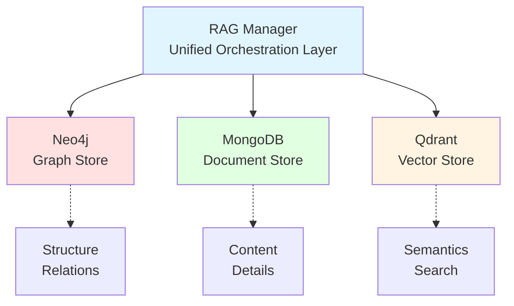

# PersonaMate Hybrid RAG Architecture

> **⚠️ LEGACY DOCUMENTATION**
> This document describes the original RAGManager architecture which has been **deprecated**.
> For the current chunk-based embedding system, see:
> - [Embedding Pipeline Documentation](embedding-pipeline.md) - Current architecture
> - [Migration Guide](embedding-migration.md) - How to migrate from RAGManager

---

## Overview (Legacy RAGManager)

PersonaMate uses a **hybrid RAG (Retrieval-Augmented Generation)** architecture combining three complementary storage systems:



## Three Storage Layers

### 1. Neo4j - Knowledge Graph (Structure)

**Purpose**: Store entities, their types, and relationships

**What it stores**:
- Entity nodes with `entity_id`, `type`, and `name`
- Relationships between entities (KNOWS, WORKS_FOR, LIKES, etc.)
- Graph structure for traversal and relationship queries

**Example**:
```cypher
(Person {name: "John Doe", entity_id: "uuid-123"})
  -[KNOWS]->
(Person {name: "Jane Smith", entity_id: "uuid-456"})
```

**Used for**:
- Finding connected entities
- Relationship navigation
- Graph-based queries

### 2. MongoDB - Document Store (Content)

**Purpose**: Store detailed, unstructured information about entities

**What it stores**:
- Full documents with biography, description, history
- Flexible JSON content (no schema constraints)
- Metadata (created_at, updated_at, source, tags, versions)

**Document Structure**:
```json
{
  "entity_id": "uuid-123",
  "entity_type": "Person",
  "entity_name": "John Doe",
  "content": {
    "biography": "Software engineer with 10 years of experience...",
    "age": 30,
    "email": "john@example.com",
    "city": "Paris",
    "occupation": "Software Engineer",
    "hobbies": ["reading", "coding", "hiking"]
  },
  "metadata": {
    "created_at": "2025-12-08T10:00:00",
    "updated_at": "2025-12-08T15:30:00",
    "source": "user_input",
    "tags": ["engineer", "python"]
  },
  "version": 2
}
```

**Used for**:
- Storing rich, detailed information
- Full-text content retrieval
- Document versioning
- Flexible schema

### 3. Qdrant - Vector Store (Semantics)

**Purpose**: Enable semantic search using embeddings

**What it stores**:
- 384-dimensional embeddings (using all-MiniLM-L6-v2)
- Vector representations of entity summaries
- Payload with entity metadata

**Vector Structure**:
```json
{
  "id": "uuid-123",
  "vector": [0.123, -0.456, 0.789, ...],  // 384 dimensions
  "payload": {
    "entity_id": "uuid-123",
    "entity_type": "Person",
    "entity_name": "John Doe",
    "text": "John Doe is a Person. Software engineer with 10 years...",
    "created_at": "2025-12-08T10:00:00"
  }
}
```

**Used for**:
- Semantic/similarity search
- Natural language queries
- Finding similar entities
- AI-powered retrieval

## Entity Lifecycle

### Creating an Entity

```python
from utils.rag_manager import RAGManager

rag = RAGManager.load()

# Create entity across all three stores
entity_id = rag.create_entity(
    entity_type="Person",
    name="John Doe",
    content={
        "biography": "Software engineer with 10 years of experience...",
        "age": 30,
        "email": "john@example.com",
        "city": "Paris",
        "occupation": "Software Engineer"
    },
    relationships=[
        ("Person", "Jane Smith", "KNOWS"),
        ("Organization", "TechCorp", "WORKS_FOR")
    ],
    metadata={"source": "user_input", "tags": ["engineer", "python"]}
)
```

**What happens**:
1. **Neo4j**: Creates Person node with `entity_id` property
2. **MongoDB**: Stores full document with content and metadata
3. **Qdrant**: Generates embedding from summary and stores vector
4. **Neo4j**: Creates relationship edges

### Retrieving an Entity

```python
# Get full context (graph + document + similar entities)
context = rag.get_entity_context(
    entity_id="uuid-123",
    include_similar=True,
    similarity_limit=3
)
```

**Returns**:
```json
{
  "entity": {
    "entity_id": "uuid-123",
    "entity_name": "John Doe",
    "entity_type": "Person",
    "content": {...},
    "metadata": {...},
    "graph_context": [...],
    "vector_info": {...}
  },
  "related_entities": [
    {
      "entity_id": "uuid-456",
      "entity_name": "Jane Smith",
      "relationship": "KNOWS",
      "direction": "out"
    }
  ],
  "similar_entities": [
    {
      "entity_id": "uuid-789",
      "entity_name": "Bob Johnson",
      "score": 0.85,
      "text": "Bob Johnson is a software engineer..."
    }
  ]
}
```

### Semantic Search

```python
# Natural language search
results = rag.search(
    query="software engineer in Paris who knows Python",
    entity_type="Person",
    limit=5,
    score_threshold=0.7
)
```

**What happens**:
1. Query is embedded using the same model (all-MiniLM-L6-v2)
2. Qdrant performs cosine similarity search
3. Results are ranked by similarity score
4. Optionally enriched with full data from MongoDB/Neo4j

## MCP Tools

### `fetch_person_data`

Comprehensive retrieval using all three stores:

```python
# Tries semantic search first, fallback to exact name matching
result = fetch_person_data(name="John Doe")
```

Returns full entity context with graph relationships and similar entities.

### `update_person_data`

Creates or updates entity across all stores:

```python
result = update_person_data(
    name="John Doe",
    properties='{"age": 31, "biography": "Updated bio...", "skills": ["Python", "Docker"]}'
)
```

Automatically updates:
- MongoDB document (merged or replaced)
- Qdrant embedding (regenerated from new content)
- Neo4j node (properties synced)

### `search_people`

Natural language semantic search:

```python
result = search_people(
    query="French-speaking software engineers",
    limit=5
)
```

## Architecture Benefits

### 1. **Structured Navigation** (Neo4j)
- Fast relationship traversal
- Graph algorithms (shortest path, community detection)
- Schema-free relationship modeling

### 2. **Rich Content** (MongoDB)
- Store unlimited detail about entities
- No schema constraints
- Document versioning
- Flexible content types

### 3. **Intelligent Search** (Qdrant)
- Natural language queries
- Similarity-based retrieval
- AI-powered entity discovery
- Semantic understanding

### 4. **Unified Access** (RAGManager)
- Single API for all operations
- Automatic synchronization
- Consistent entity_id across stores
- Transactional integrity

## Data Flow Examples

### Example 1: "Tell me about John"

```
User Query: "Tell me about John"
     │
     ▼
┌─────────────────┐
│  MCP Tool       │
│  fetch_person   │
└────────┬────────┘
         │
         ▼
┌─────────────────┐
│  RAGManager     │  1. Semantic search in Qdrant
│  .search()      │     → Find "John Doe" (score: 0.95)
└────────┬────────┘
         │
         ▼
┌─────────────────┐
│  RAGManager     │  2. Get full context
│  .get_context() │     → MongoDB: biography, age, email
└────────┬────────┘     → Neo4j: relationships (KNOWS Jane)
         │              → Qdrant: similar people
         ▼
    [Response]
```

### Example 2: "Create a person named Alice"

```
User Action: Create Alice
     │
     ▼
┌─────────────────┐
│  MCP Tool       │
│  update_person  │
└────────┬────────┘
         │
         ▼
┌─────────────────┐
│  RAGManager     │  1. Generate entity_id: uuid-abc
│  .create()      │  2. Create in all 3 stores:
└────────┬────────┘
         │
         ├─────────► Neo4j: (Person {name: "Alice", entity_id: "uuid-abc"})
         │
         ├─────────► MongoDB: {entity_id: "uuid-abc", content: {...}}
         │
         └─────────► Qdrant: {id: "uuid-abc", vector: [...], payload: {...}}
```

## Configuration

### Environment Variables

```bash
# Neo4j
NEO4J_URI=bolt://neo4j:7687
NEO4J_USER=neo4j
NEO4J_PASSWORD=personamate
NEO4J_DB=neo4j

# MongoDB
MONGODB_URI=mongodb://mongodb:27017
MONGODB_DB=personamate

# Qdrant
QDRANT_URI=http://qdrant:6333
```

### Docker Compose Services

```yaml
services:
  neo4j:
    image: neo4j:5.9
    ports: ["7474:7474", "7687:7687"]

  mongodb:
    image: mongo:7.0
    ports: ["27017:27017"]

  qdrant:
    image: qdrant/qdrant:latest
    ports: ["6333:6333"]
```

## Usage Examples

### Python API

```python
from utils.rag_manager import RAGManager

# Initialize
rag = RAGManager.load()

# Create entity
entity_id = rag.create_entity(
    entity_type="Person",
    name="Alice",
    content={"biography": "...", "age": 25}
)

# Search
results = rag.search("data scientist in NYC")

# Get full context
context = rag.get_entity_context(entity_id)

# Update
rag.update_entity(entity_id, content={"age": 26})

# Add relationship
rag.add_relationship(
    source_entity_id=entity_id,
    target_entity_id=other_id,
    relationship_type="KNOWS"
)

# Close connections
rag.close()
```

### MCP Tools (via OpenWebUI)

```
User: "Tell me about John Doe"
→ MCP calls fetch_person_data("John Doe")
→ Returns full context with relationships

User: "Create a person named Alice, age 25, software engineer"
→ MCP calls update_person_data("Alice", '{"age": 25, "occupation": "Software Engineer"}')
→ Entity created across all stores

User: "Find engineers in Paris"
→ MCP calls search_people("engineers in Paris")
→ Returns semantic search results
```

## Performance Considerations

### Indexing
- **Neo4j**: Automatic indexing on `entity_id` and `name`
- **MongoDB**: Indexes on `entity_id`, `entity_type`, `entity_name`, `metadata.tags`
- **Qdrant**: HNSW index for fast vector search

### Embedding Model
- **Model**: all-MiniLM-L6-v2 (384 dimensions)
- **Speed**: ~1000 vectors/sec on CPU
- **Quality**: Good balance between speed and accuracy

### Scalability
- **Neo4j**: Handles millions of nodes and relationships
- **MongoDB**: Horizontal scaling with sharding
- **Qdrant**: Distributed deployment, billions of vectors

## Future Enhancements

1. **Multi-modal embeddings**: Images, audio, video
2. **Automatic relationship extraction**: NLP-based entity linking
3. **Temporal queries**: Time-based entity evolution
4. **Federation**: Multiple RAG systems linked together
5. **Advanced graph algorithms**: Community detection, centrality
6. **Real-time updates**: Change streams and event-driven sync

## References

- [Neo4j Graph Database](https://neo4j.com/)
- [MongoDB Document Store](https://www.mongodb.com/)
- [Qdrant Vector Database](https://qdrant.tech/)
- [Sentence Transformers](https://www.sbert.net/)
- [Model Context Protocol (MCP)](https://modelcontextprotocol.io/)
