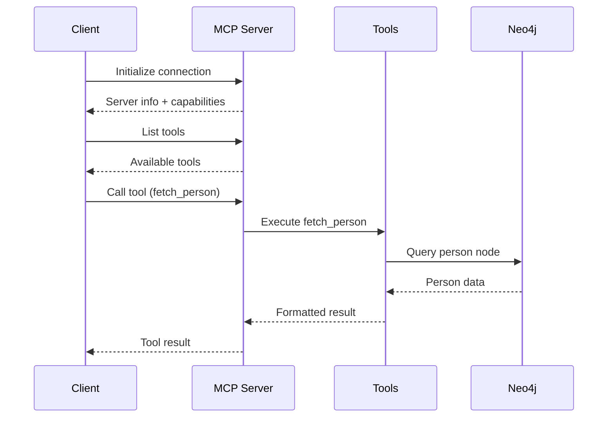

# Project Structure

This page documents the organization of the PersonaMate codebase.

## Directory Layout

```
PersonaMate/
├── .github/
│   └── workflows/
│       ├── ci.yml              # GitHub Actions CI/CD pipeline
│       └── README.md           # CI/CD documentation
├── docs/                       # Documentation (MkDocs)
│   ├── index.md               # Home page
│   ├── quickstart.md          # Quick start guide
│   ├── deployment.md          # Deployment guide
│   ├── docker.md              # Docker documentation
│   ├── contributing.md        # Contribution guidelines
│   ├── workflows.md           # CI/CD pipeline docs
│   ├── testing.md             # Testing guide
│   ├── structure.md           # This file
│   ├── mcp.md                 # MCP protocol docs
│   └── api/                   # API reference
│       ├── tools.md           # MCP tools
│       └── resources.md       # MCP resources
├── src/
│   ├── python/
│   │   ├── mcp_server.py      # FastMCP server (main entry point)
│   │   ├── fastmcp.json       # FastMCP configuration
│   │   ├── tools/             # MCP tool implementations
│   │   │   ├── personalDataTool.py  # Person CRUD operations
│   │   │   └── linkingTool.py       # Relationship management
│   │   └── utils/             # Shared utilities
│   │       ├── neo4j_graph.py       # Neo4j wrapper
│   │       ├── helper.py            # Utility functions
│   │       └── MultiPurposeGraph.py # Graph abstraction
│   └── templates/
│       └── index.html         # Web templates (if needed)
├── test/
│   └── python/
│       ├── test_mcp_integration.py  # MCP protocol tests (6 tests)
│       ├── test_tools.py            # Tool implementation tests (14 tests)
│       └── utils/
│           └── MultiPurposeGraph_test.py  # Graph utility tests
├── deploy.ps1                 # Windows PowerShell deployment script
├── deploy.sh                  # Linux/macOS Bash deployment script
├── docker-compose.yml         # Docker services orchestration
├── Dockerfile                 # MCP server container image
├── mkdocs.yml                 # Documentation site configuration
├── .pre-commit-config.yaml    # Pre-commit hooks configuration
├── requirements.txt           # Python dependencies
├── create_data.sh            # Sample data creation script
├── LICENSE                    # Project license
└── README.md                  # Main project README
```

## Core Components

### MCP Server (`src/python/mcp_server.py`)

The main entry point for PersonaMate. Built with FastMCP framework.

**Key responsibilities:**
- Initialize MCP server with SSE transport
- Register tools and resources
- Handle MCP protocol communication
- Manage Neo4j connection lifecycle

**Key code:**
```python
from fastmcp import FastMCP

mcp = FastMCP("personamate")

@mcp.tool()
async def fetch_person(name: str) -> str:
    """Fetch person data from graph"""
    # Implementation
```

**Dependencies:**
- FastMCP SDK (MCP protocol implementation)
- Neo4j driver (graph database)
- Tool implementations

### Tools Directory (`src/python/tools/`)

Modular tool implementations for PersonaMate functionality.

#### Personal Data Tool (`personalDataTool.py`)

Manages person entities in the knowledge graph.

**Functions:**
- `fetch_person(name: str)` - Retrieve person information
- `update_person(name: str, **kwargs)` - Create or update person

**Key features:**
- Case-insensitive name matching
- JSON storage for nested objects (addresses)
- Neo4j transaction management
- Error handling for missing persons

**Database schema:**
```cypher
(:Person {
    name: string,
    age: integer,
    email: string,
    phone: string,
    address: string  // JSON serialized
})
```

#### Linking Tool (`linkingTool.py`)

Manages relationships between entities in the graph.

**Functions:**
- `link_entities(from_entity: str, to_entity: str, relationship_type: str)` - Create relationship
- `get_entity_context(entity_name: str)` - Get entity's relationship context

**Key features:**
- Dynamic relationship types
- Bidirectional relationship queries
- Rich context with properties
- Multi-hop traversal

**Database schema:**
```cypher
(:Person)-[r:RELATIONSHIP_TYPE {
    created_at: datetime,
    properties: map
}]->(:Person)
```

### Utilities Directory (`src/python/utils/`)

Shared utility functions and abstractions.

#### Neo4j Graph (`neo4j_graph.py`)

Neo4j database connection and query wrapper.

**Key responsibilities:**
- Connection management
- Query execution
- Transaction handling
- Error handling

#### Helper Functions (`helper.py`)

Common utility functions used across the codebase.

**Functions:**
- String manipulation
- Data validation
- Format conversion
- Logging utilities

#### MultiPurpose Graph (`MultiPurposeGraph.py`)

Graph abstraction layer for flexible graph operations.

**Features:**
- Abstract graph interface
- Multiple backend support
- Query optimization
- Caching layer

## Test Structure

### MCP Integration Tests (`test/python/test_mcp_integration.py`)

Tests MCP protocol compliance and server functionality.

**Test coverage:**
- Server initialization
- Tool listing
- Resource listing
- Tool invocation
- Resource reading
- Prompt listing

**Dependencies:**
- MCP server must be running
- Neo4j database connection
- MCP SDK client

### Tool Implementation Tests (`test/python/test_tools.py`)

Tests tool functionality and business logic.

**Test coverage:**
- Person CRUD operations
- Relationship creation
- Context retrieval
- Edge cases and errors
- Cross-tool workflows

**Dependencies:**
- Neo4j database connection
- Tool implementations
- Test fixtures

## Configuration Files

### Docker Compose (`docker-compose.yml`)

Orchestrates all services for PersonaMate.

**Services:**
- `neo4j` - Graph database
- `mcp` - MCP server (PersonaMate)
- `openwebui` - Chat interface (optional)
- `pytest` - Test runner

**Networks:**
- `personamate-network` - Internal service communication

**Volumes:**
- `neo4j_data` - Persistent graph data
- `openwebui_data` - OpenWebUI state

### Dockerfile

Container image for MCP server.

**Base image:** Python 3.10
**Key layers:**
- Install Python dependencies
- Copy source code
- Set environment variables
- Expose ports
- Run FastMCP server

### MkDocs Configuration (`mkdocs.yml`)

Documentation website configuration.

**Theme:** Material for MkDocs
**Features:**
- Dark/light mode toggle
- Search functionality
- Code syntax highlighting
- Tabbed content
- Git revision dates

**Plugins:**
- search
- git-revision-date-localized

### Pre-commit Configuration (`.pre-commit-config.yaml`)

Git hooks for code quality.

**Hooks:**
- `black` - Code formatting (120 char)
- `flake8` - Linting
- `isort` - Import sorting
- `trailing-whitespace` - Remove trailing spaces
- `end-of-file-fixer` - Single newline at EOF

## Deployment Scripts

### Windows Deployment (`deploy.ps1`)

PowerShell script for Windows deployment.

**Features:**
- Interactive menu
- Prerequisites validation
- Service health checks
- Colored output
- Error handling

**Modes:**
- Interactive: Menu-driven deployment
- Direct: Command-line arguments

### Linux/macOS Deployment (`deploy.sh`)

Bash script for Unix-based systems.

**Features:**
- Same functionality as PowerShell version
- Cross-platform compatibility
- POSIX-compliant shell commands
- Colored output

## CI/CD Pipeline

### GitHub Actions (`..github/workflows/ci.yml`)

Automated testing and deployment pipeline.

**Jobs:**
1. **Test Job** - Run all tests in Docker
2. **Lint Job** - Check and auto-format code
3. **Build Job** - Validate Docker builds (main branch only)

**Triggers:**
- Push to `main` or `dev` branches
- Pull requests to `main` or `dev` branches

**Secrets required:**
- `OPENAI_API_KEY` - OpenAI API key
- `LANGCHAIN_API_KEY` - (Optional) LangChain tracing

## Data Flow



## Extension Points

PersonaMate is designed to be extensible:

### Adding New Tools

1. Create tool file in `src/python/tools/`
2. Implement tool function with type hints
3. Register tool in `mcp_server.py`
4. Add tests in `test/python/test_tools.py`
5. Document in `docs/api/tools.md`

### Adding New Resources

1. Create resource handler in `mcp_server.py`
2. Register resource with `@mcp.resource()`
3. Add tests in `test/python/test_mcp_integration.py`
4. Document in `docs/api/resources.md`

### Adding New Graph Operations

1. Add function to appropriate tool file
2. Update Neo4j queries in `utils/neo4j_graph.py`
3. Add tests
4. Update documentation

## Best Practices

### Code Organization

- One tool per file in `src/python/tools/`
- Shared utilities in `src/python/utils/`
- Tests mirror source structure
- Keep tools focused and single-purpose

### Naming Conventions

- Snake_case for Python functions
- PascalCase for Python classes
- UPPER_CASE for relationship types in Neo4j
- Descriptive function names (verb_noun pattern)

### Documentation

- Docstrings for all public functions
- Type hints for all parameters
- Examples in docstrings
- Keep README.md updated

### Testing

- Test file per source file
- Test class per source class
- Descriptive test names
- One assertion per test concept

## Next Steps

- **[MCP Tools →](mcp/tools.md)** Explore available tools
- **[Testing Guide →](testing.md)** Learn how to test
- **[Contributing →](contributing.md)** Start contributing
