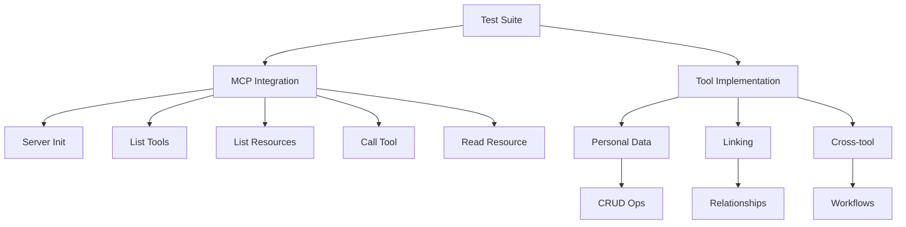

# Testing Guide

PersonaMate has comprehensive test coverage with automated tests for both MCP protocol integration and tool implementations.

## Test Overview

| Test Suite | Tests | Coverage | Purpose |
|------------|-------|----------|---------|
| MCP Integration | 6 tests | MCP protocol compliance | Validates server initialization, tool/resource listing, protocol conformance |
| Tool Implementation | 14 tests | Tool functionality | Tests CRUD operations, relationships, cross-tool workflows |
| **Total** | **20 tests** | **Full coverage** | End-to-end validation |



## Running Tests

### Quick Test (All Tests)

```bash
# Start services
docker compose up -d neo4j mcp

# Run all tests
docker compose run --rm pytest pytest /app/test/python/ -v
```

### Test by Suite

```bash
# MCP integration tests only (6 tests)
docker compose run --rm pytest pytest /app/test/python/test_mcp_integration.py -v

# Tool implementation tests only (14 tests)
docker compose run --rm pytest pytest /app/test/python/test_tools.py -v
```

### Test with Coverage

```bash
# Generate coverage report
docker compose run --rm pytest pytest /app/test/python/ -v \
  --cov=/app/src/python \
  --cov-report=term \
  --cov-report=html

# View HTML coverage report
# Open htmlcov/index.html in browser
```

### Test Specific Function

```bash
# Test single function
docker compose run --rm pytest pytest /app/test/python/test_tools.py::TestPersonalDataTool::test_fetch_person_data_existing -v

# Test class
docker compose run --rm pytest pytest /app/test/python/test_tools.py::TestPersonalDataTool -v
```

## Test Suites

### MCP Integration Tests

**File**: `test/python/test_mcp_integration.py`

Tests Model Context Protocol compliance and server functionality.

#### Test: Server Initialization
```python
@pytest.mark.asyncio
async def test_server_initialization():
    """Test that MCP server initializes correctly"""
    result = await client.initialize()
    assert result.protocolVersion == "2024-11-05"
    assert result.serverInfo.name == "personamate"
```

**Validates:**
- Server starts successfully
- Protocol version matches spec
- Server name configured correctly

#### Test: List Tools
```python
@pytest.mark.asyncio
async def test_list_tools():
    """Test listing available tools"""
    result = await client.list_tools()
    tool_names = [tool.name for tool in result.tools]
    assert "fetch_person" in tool_names
    assert "update_person" in tool_names
```

**Validates:**
- All tools exposed via MCP
- Tool schemas correct
- Tool names match specification

#### Test: List Resources
```python
@pytest.mark.asyncio
async def test_list_resources():
    """Test listing available resources"""
    result = await client.list_resources()
    uris = [resource.uri for resource in result.resources]
    assert "graph://persons" in uris
```

**Validates:**
- Resources discoverable
- Resource URIs correct
- Resource descriptions present

#### Test: Call Tool
```python
@pytest.mark.asyncio
async def test_call_tool():
    """Test calling a tool via MCP"""
    result = await client.call_tool("update_person", {
        "name": "Alice Johnson",
        "age": 30
    })
    assert result.content[0].type == "text"
```

**Validates:**
- Tool invocation works
- Parameters passed correctly
- Results returned in correct format

#### Test: Read Resource
```python
@pytest.mark.asyncio
async def test_read_resource():
    """Test reading a resource via MCP"""
    result = await client.read_resource("graph://persons")
    assert len(result.contents) > 0
```

**Validates:**
- Resource reading works
- Content returned correctly
- Resource format valid

#### Test: List Prompts
```python
@pytest.mark.asyncio
async def test_list_prompts():
    """Test listing available prompts"""
    result = await client.list_prompts()
    prompt_names = [prompt.name for prompt in result.prompts]
    assert "person_lookup_prompt" in prompt_names
```

**Validates:**
- Prompts exposed
- Prompt metadata correct
- Arguments defined properly

**Prerequisites:**
- MCP server must be running: `docker compose up -d mcp`
- Neo4j must be running: `docker compose up -d neo4j`

### Tool Implementation Tests

**File**: `test/python/test_tools.py`

Tests actual functionality of PersonaMate tools.

#### Personal Data Tool Tests (7 tests)

**Test: Create Person**
```python
@pytest.mark.asyncio
async def test_update_person_data_new_person(self):
    """Test creating a new person in the graph"""
    result = await update_person(
        name="John Doe",
        age=30,
        email="john@example.com",
        phone="123-456-7890",
        address={"street": "123 Main St", "city": "Boston"}
    )
    assert "John Doe" in result
```

**Validates:**
- Person creation
- Property storage
- Nested address object (JSON)

**Test: Fetch Person**
```python
@pytest.mark.asyncio
async def test_fetch_person_data_existing(self):
    """Test fetching an existing person"""
    result = await fetch_person(name="John Doe")
    assert "John Doe" in result
    assert "123 Main St" in result
```

**Validates:**
- Person lookup
- Property retrieval
- JSON deserialization

**Test: Update Person**
```python
@pytest.mark.asyncio
async def test_update_person_data_update_existing(self):
    """Test updating an existing person"""
    result = await update_person(name="John Doe", age=31)
    assert "updated" in result.lower() or "created" in result.lower()
```

**Validates:**
- Person updates
- Partial updates (only specified fields)
- Idempotency

**Test: Case-Insensitive Matching**
```python
@pytest.mark.asyncio
async def test_fetch_person_data_case_insensitive(self):
    """Test case-insensitive person lookup"""
    result = await fetch_person(name="john doe")
    assert "John Doe" in result
```

**Validates:**
- Case-insensitive lookups
- Name normalization
- Consistent retrieval

**Test: Not Found**
```python
@pytest.mark.asyncio
async def test_fetch_person_data_nonexistent(self):
    """Test fetching a non-existent person"""
    result = await fetch_person(name="Nonexistent Person")
    assert "not found" in result.lower()
```

**Validates:**
- Error handling
- Clear error messages
- Graceful failures

#### Linking Tool Tests (6 tests)

**Test: Create Relationship**
```python
@pytest.mark.asyncio
async def test_link_entities_create_relationship(self):
    """Test creating a relationship between entities"""
    result = await link_entities(
        from_entity="Alice",
        to_entity="Bob",
        relationship_type="FRIEND_OF"
    )
    assert "created" in result.lower() or "alice" in result.lower()
```

**Validates:**
- Relationship creation
- Entity linking
- Relationship types

**Test: Get Context**
```python
@pytest.mark.asyncio
async def test_get_entity_context(self):
    """Test getting context for an entity"""
    result = await get_entity_context(entity_name="Alice")
    assert "Alice" in result
    assert "relationships" in result.lower() or "connected" in result.lower()
```

**Validates:**
- Context retrieval
- Relationship traversal
- Graph queries

**Test: Bidirectional Relationships**
```python
@pytest.mark.asyncio
async def test_link_entities_bidirectional(self):
    """Test that relationships are queryable in both directions"""
    await link_entities("Alice", "Charlie", "WORKS_WITH")

    alice_context = await get_entity_context("Alice")
    charlie_context = await get_entity_context("Charlie")

    assert "Charlie" in alice_context
    assert "Alice" in charlie_context
```

**Validates:**
- Bidirectional queries
- Graph traversal
- Relationship symmetry

#### Cross-Tool Integration Test (1 test)

**Test: End-to-End Workflow**
```python
@pytest.mark.asyncio
async def test_cross_tool_workflow(self):
    """Test complete workflow across tools"""
    # Create person
    await update_person(name="David Smith", age=35)

    # Link to another person
    await link_entities("David Smith", "Alice", "COLLEAGUE_OF")

    # Fetch person data
    person_result = await fetch_person("David Smith")
    assert "David Smith" in person_result

    # Get relationship context
    context_result = await get_entity_context("David Smith")
    assert "Alice" in context_result
```

**Validates:**
- Multi-tool workflows
- Data consistency
- End-to-end functionality

**Prerequisites:**
- Neo4j must be running: `docker compose up -d neo4j`
- No MCP server required (tests tools directly)

## Writing Tests

### Test Structure

```python
import pytest
from src.python.tools.personalDataTool import fetch_person, update_person

@pytest.mark.asyncio  # Required for async tests
async def test_my_feature():
    """Clear description of what this tests"""
    # Arrange: Set up test data
    await update_person(name="Test User", age=25)

    # Act: Perform action
    result = await fetch_person("Test User")

    # Assert: Verify result
    assert "Test User" in result
    assert "25" in result
```

### Best Practices

1. **Use descriptive names**: `test_fetch_person_returns_error_for_nonexistent_user`
2. **One assertion per concept**: Test one behavior at a time
3. **Clean up data**: Use fixtures for setup/teardown
4. **Test edge cases**: Empty inputs, special characters, large data
5. **Test error conditions**: Not just happy paths

### Test Fixtures

Create reusable test data:

```python
@pytest.fixture
async def sample_person():
    """Create a sample person for testing"""
    await update_person(
        name="Test Person",
        age=30,
        email="test@example.com"
    )
    yield "Test Person"
    # Cleanup if needed
```

Use in tests:

```python
@pytest.mark.asyncio
async def test_something(sample_person):
    result = await fetch_person(sample_person)
    assert "Test Person" in result
```

## CI/CD Integration

Tests run automatically on every push and pull request via GitHub Actions.

**Test job workflow:**
```yaml
- name: Start services
  run: docker compose up -d neo4j mcp

- name: Run MCP tests
  run: docker compose run --rm pytest pytest /app/test/python/test_mcp_integration.py -v

- name: Run tool tests
  run: docker compose run --rm pytest pytest /app/test/python/test_tools.py -v

- name: Generate coverage
  run: docker compose run --rm pytest pytest /app/test/python/ -v --cov
```

See **[CI/CD Pipeline →](workflows.md)** for full details.

## Troubleshooting

### Tests Hang or Timeout

**Cause**: Services not running or not initialized

**Solution:**
```bash
# Check service status
docker compose ps

# View logs
docker compose logs neo4j
docker compose logs mcp

# Restart services
docker compose restart neo4j mcp
```

### Neo4j Connection Errors

**Cause**: Neo4j not ready or wrong credentials

**Solution:**
```bash
# Wait for Neo4j to initialize
sleep 15

# Check Neo4j logs
docker compose logs neo4j | grep "Started"

# Verify credentials in .env
NEO4J_USER=neo4j
NEO4J_PASSWORD=personamate
```

### MCP Integration Tests Fail

**Cause**: MCP server not running

**Solution:**
```bash
# Start MCP server
docker compose up -d mcp

# Wait for startup
sleep 5

# Verify MCP server
curl http://localhost:8080/health
```

### Import Errors

**Cause**: Python path not set correctly

**Solution:**
```bash
# Add src to PYTHONPATH
export PYTHONPATH="${PYTHONPATH}:/app/src/python"

# Or run via Docker (recommended)
docker compose run --rm pytest pytest /app/test/python/ -v
```

### Test Data Persists Between Runs

**Cause**: Neo4j database not cleared

**Solution:**
```bash
# Clear Neo4j data
docker compose down -v
docker compose up -d neo4j

# Wait for initialization
sleep 15
```

## Next Steps

- **[CI/CD Pipeline →](workflows.md)** Understand automated testing
- **[Contributing Guide →](contributing.md)** Learn development workflow
- **[MCP Tools →](mcp/tools.md)** Explore available MCP tools
