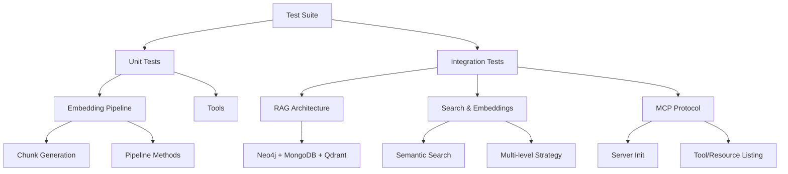

# Testing Guide

PersonaMate has comprehensive test coverage with unit tests, integration tests, and MCP protocol validation.

## Test Overview

| Test Suite | Type | Tests | Purpose |
|------------|------|-------|---------|
| Embedding Pipeline | Unit | 15+ | Chunk generation, pipeline orchestration |
| RAG Architecture | Integration | 12+ | Full workflow across Neo4j/MongoDB/Qdrant |
| Search & Embeddings | Integration | 20+ | Semantic search quality and ranking |
| MCP Integration | Integration | 6 | MCP protocol compliance |
| Tools | Unit | 14 | Tool functionality and workflows |
| **Total** | **Mixed** | **67+** | **Complete RAG system validation** |



## Test Files

### Unit Tests

#### 1. `test_embedding_pipeline.py`
**Focus**: Chunk generation and embedding pipeline components (no services required).

**Test Classes**:
- `TestChunkGenerator`: Global/attribute chunk creation
- `TestEmbeddingPipeline`: Entity processing with mocks
- `TestChunkFormatting`: Text formatting for chunks

**Run**:
```bash
pytest test/python/test_embedding_pipeline.py -v
```

#### 2. `test_tools.py`
**Focus**: PersonaMate tool functions (mocked dependencies).

**Run**:
```bash
pytest test/python/test_tools.py -v
```

---

### Integration Tests

#### 3. `test_rag_architecture.py` ⭐ NEW
**Focus**: End-to-end RAG workflow across all three stores.

**Prerequisites**: Neo4j, MongoDB, Qdrant running

**Test Classes**:
- `TestRAGArchitectureIntegration`: Create/store/retrieve flows
- `TestEmbeddingPipelineIntegration`: Pipeline end-to-end
- `TestDataConsistency`: Cross-store validation

**Run**:
```bash
# Start services
docker compose up -d neo4j mongodb qdrant

# Run tests
pytest test/python/test_rag_architecture.py -v -s
```

#### 4. `test_search_embeddings.py` ⭐ NEW
**Focus**: Semantic search quality and embedding generation.

**Prerequisites**: Qdrant running

**Test Classes**:
- `TestEmbeddingGeneration`: 384-dim embeddings, similarity
- `TestChunkGeneration`: Chunk strategy validation
- `TestSemanticSearch`: Search functionality and filters
- `TestMultiLevelEmbeddings`: Global + attribute strategy
- `TestSearchRanking`: Result relevance and scoring
- `TestEmbeddingPersistence`: Storage and retrieval

**Run**:
```bash
# Start Qdrant
docker compose up -d qdrant

# Run tests
pytest test/python/test_search_embeddings.py -v -s
```

#### 5. `test_mcp_integration.py`
**Focus**: MCP server protocol compliance.

**Run**:
```bash
docker compose run --rm pytest pytest /app/test/python/test_mcp_integration.py -v
```

---

## Running Tests

### Quick Test Scripts

PersonaMate provides convenient scripts in the `scripts/` directory:

**PowerShell (Windows):**
```powershell
# Unit Tests (fast, no services)
.\scripts\run-unit-tests.ps1

# RAG Architecture Tests (Neo4j + MongoDB + Qdrant)
.\scripts\run-rag-tests.ps1

# Search & Embeddings Tests (Qdrant + MongoDB)
.\scripts\run-search-tests.ps1

# Complete Test Suite (all tests with coverage)
.\scripts\run-all-tests.ps1
```

**Bash (Linux/macOS):**
```bash
# Unit Tests (fast, no services)
bash scripts/run-unit-tests.sh

# RAG Architecture Tests (Neo4j + MongoDB + Qdrant)
bash scripts/run-rag-tests.sh

# Search & Embeddings Tests (Qdrant + MongoDB)
bash scripts/run-search-tests.sh

# Complete Test Suite (all tests with coverage)
bash scripts/run-all-tests.sh

# Original Integration Tests (Neo4j only)
bash scripts/run-integration-tests.sh
```

---

### Manual Test Execution

### Quick Test (All Tests)

```bash
# Start all services
docker compose up -d neo4j mongodb qdrant

# Run complete test suite
pytest test/python/ -v

# With coverage report (XML for codecov.io)
pytest test/python/ -v --cov=src/python --cov-report=xml --cov-report=term
```

### Test by Category

**Unit Tests Only** (fast, no services):
```bash
pytest test/python/test_embedding_pipeline.py test/python/test_tools.py -v
```

**Integration Tests** (require services):
```bash
# Start services first
docker compose up -d neo4j mongodb qdrant

# Run integration tests
pytest test/python/test_rag_architecture.py test/python/test_search_embeddings.py test/python/test_mcp_integration.py -v -s
```

**Search & Embedding Tests Only**:
```bash
pytest test/python/test_search_embeddings.py -v -s
```

**Specific Test Class**:
```bash
# Run only semantic search tests
pytest test/python/test_search_embeddings.py::TestSemanticSearch -v

# Run only RAG integration tests
pytest test/python/test_rag_architecture.py::TestRAGArchitectureIntegration -v
```

---

## Test Coverage

### Generate Coverage Report
```bash
# XML report (for codecov.io)
pytest test/python/ --cov=src/python --cov-report=xml

# Terminal report
pytest test/python/ --cov=src/python --cov-report=term

# Upload to codecov.io
curl -Os https://uploader.codecov.io/latest/linux/codecov
chmod +x codecov
./codecov -t ${CODECOV_TOKEN}
```

### Coverage Goals
- **Embedding Pipeline**: >85% (chunk generation, pipeline logic)
- **RAG Tools**: >75% (integration points)
- **Search Logic**: >80% (semantic search, ranking)
- **Overall Target**: >75%

---

## Test Data Management

### Test Entity ID Convention
All tests use `test:` prefix for entity IDs:
```python
entity_id = f"test:ml_engineer_{uuid4().hex[:8]}"
```

### Cleanup Test Data

**Neo4j**:
```cypher
MATCH (n) WHERE n.id STARTS WITH 'test:' DETACH DELETE n
```

**MongoDB**:
```javascript
db.documents.deleteMany({ entity_id: /^test:/ })
```

**Qdrant**: Automatically cleaned by tests using `delete_entity_chunks()`.

### Automated Cleanup Script
```python
# scripts/cleanup_test_data.py
from src.python.utils.neo4j_graph import Neo4jGraph
from src.python.utils.mongo_store import MongoStore

neo4j = Neo4jGraph.load()
mongo = MongoStore.load()

neo4j._driver.execute_query(
    "MATCH (n) WHERE n.id STARTS WITH 'test:' DETACH DELETE n"
)

mongo._db.documents.delete_many({"entity_id": {"$regex": "^test:"}})
print("✓ Test data cleaned")
```

---

## Test Environment Setup

### 1. Install Dependencies
```bash
pip install pytest pytest-cov pytest-mock numpy
```

### 2. Start Services
```bash
# All services for full test suite
docker compose up -d neo4j mongodb qdrant

# Check health
docker compose ps
```

### 3. Environment Variables
```bash
# Required for integration tests
export NEO4J_URI=bolt://localhost:7687
export NEO4J_PASSWORD=your_password
export MONGODB_URI=mongodb://localhost:27017
export QDRANT_HOST=localhost
```

---

## Debugging Tests

### Run with Verbose Output
```bash
pytest test/python/test_search_embeddings.py -v -s
```

### Run Single Test
```bash
pytest test/python/test_rag_architecture.py::TestRAGArchitectureIntegration::test_create_entity_across_all_stores -v -s
```

### Use Debugger
```bash
pytest test/python/test_embedding_pipeline.py --pdb
```

### Print Test Output
```bash
# Shows print() statements
pytest test/python/ -v -s
```

---

## CI/CD Integration

### GitHub Actions Example
```yaml
name: Test Suite

on: [push, pull_request]

jobs:
  test:
    runs-on: ubuntu-latest

    services:
      neo4j:
        image: neo4j:latest
        env:
          NEO4J_AUTH: neo4j/test_password
        ports:
          - 7687:7687

      mongodb:
        image: mongo:latest
        ports:
          - 27017:27017

      qdrant:
        image: qdrant/qdrant:latest
        ports:
          - 6333:6333

    steps:
      - uses: actions/checkout@v3

      - name: Set up Python
        uses: actions/setup-python@v4
        with:
          python-version: '3.11'

      - name: Install dependencies
        run: pip install -r requirements.txt pytest pytest-cov

      - name: Run tests
        env:
          NEO4J_URI: bolt://localhost:7687
          NEO4J_PASSWORD: test_password
          MONGODB_URI: mongodb://localhost:27017
          QDRANT_HOST: localhost
        run: pytest test/python/ -v --cov=src/python --cov-report=xml --cov-report=term

      - name: Upload coverage to codecov.io
        uses: codecov/codecov-action@v3
        with:
          file: ./coverage.xml
          fail_ci_if_error: true
```

---

## Troubleshooting

### Services Not Available
```bash
# Check service logs
docker compose logs neo4j
docker compose logs mongodb
docker compose logs qdrant

# Restart services
docker compose restart
```

### Connection Timeouts
```bash
# Verify ports are accessible
nc -zv localhost 7687  # Neo4j
nc -zv localhost 27017 # MongoDB
nc -zv localhost 6333  # Qdrant

# Check firewall rules
sudo ufw status  # Linux
```

### Import Errors
```bash
# Add src to PYTHONPATH
export PYTHONPATH="${PYTHONPATH}:$(pwd)/src/python"

# Or use pytest pythonpath
pytest --pythonpath=src/python test/python/
```

### Slow Tests
```bash
# Skip integration tests
pytest test/python/ -v --ignore=test/python/test_rag_architecture.py --ignore=test/python/test_search_embeddings.py

# Run only unit tests
pytest test/python/test_embedding_pipeline.py test/python/test_tools.py -v
```

---

## Writing New Tests

### Unit Test Template
```python
import pytest
from unittest.mock import Mock, patch

class TestYourFeature:
    """Tests for YourFeature"""

    @pytest.fixture
    def mock_deps(self):
        with patch('module.Dependency') as mock:
            yield mock

    def test_basic_functionality(self, mock_deps):
        # Arrange
        instance = YourClass()

        # Act
        result = instance.method()

        # Assert
        assert result is not None
```

### Integration Test Template
```python
import pytest
from uuid import uuid4

@pytest.fixture(scope="module")
def pipeline():
    try:
        pipe = EmbeddingPipeline.load()
        yield pipe
    except Exception as e:
        pytest.skip(f"Services unavailable: {e}")

class TestYourIntegration:
    def test_workflow(self, pipeline):
        entity_id = f"test:feature_{uuid4().hex[:8]}"

        try:
            # Test logic
            pass
        finally:
            # Cleanup
            pipeline.vector_store.delete_entity_chunks(entity_id)
```

---

## Test Summary

| Category | File | Speed | Services | Purpose |
|----------|------|-------|----------|---------|
| Unit | `test_embedding_pipeline.py` | Fast | None | Component testing |
| Unit | `test_tools.py` | Fast | Mocked | Tool logic |
| Integration | `test_rag_architecture.py` | Slow | All 3 | Full workflow |
| Integration | `test_search_embeddings.py` | Medium | Qdrant | Search quality |
| Integration | `test_mcp_integration.py` | Fast | Neo4j | MCP protocol |

**Quick Commands**:
```bash
# Fast (unit tests only)
pytest test/python/test_embedding_pipeline.py test/python/test_tools.py -v

# Full suite
pytest test/python/ -v --cov=src/python

# Integration only
pytest test/python/test_rag_architecture.py test/python/test_search_embeddings.py -v -s
```

---
# Generate coverage report
docker compose run --rm pytest pytest /app/test/python/ -v \
  --cov=/app/src/python \
  --cov-report=term \
  --cov-report=html

# View HTML coverage report
# Open htmlcov/index.html in browser
```

### Test Specific Function

```bash
# Test single function
docker compose run --rm pytest pytest /app/test/python/test_tools.py::TestPersonalDataTool::test_fetch_person_data_existing -v

# Test class
docker compose run --rm pytest pytest /app/test/python/test_tools.py::TestPersonalDataTool -v
```

## Test Suites

### MCP Integration Tests

**File**: `test/python/test_mcp_integration.py`

Tests Model Context Protocol compliance and server functionality.

#### Test: Server Initialization
```python
@pytest.mark.asyncio
async def test_server_initialization():
    """Test that MCP server initializes correctly"""
    result = await client.initialize()
    assert result.protocolVersion == "2024-11-05"
    assert result.serverInfo.name == "personamate"
```

**Validates:**
- Server starts successfully
- Protocol version matches spec
- Server name configured correctly

#### Test: List Tools
```python
@pytest.mark.asyncio
async def test_list_tools():
    """Test listing available tools"""
    result = await client.list_tools()
    tool_names = [tool.name for tool in result.tools]
    assert "fetch_person" in tool_names
    assert "update_person" in tool_names
```

**Validates:**
- All tools exposed via MCP
- Tool schemas correct
- Tool names match specification

#### Test: List Resources
```python
@pytest.mark.asyncio
async def test_list_resources():
    """Test listing available resources"""
    result = await client.list_resources()
    uris = [resource.uri for resource in result.resources]
    assert "graph://persons" in uris
```

**Validates:**
- Resources discoverable
- Resource URIs correct
- Resource descriptions present

#### Test: Call Tool
```python
@pytest.mark.asyncio
async def test_call_tool():
    """Test calling a tool via MCP"""
    result = await client.call_tool("update_person", {
        "name": "Alice Johnson",
        "age": 30
    })
    assert result.content[0].type == "text"
```

**Validates:**
- Tool invocation works
- Parameters passed correctly
- Results returned in correct format

#### Test: Read Resource
```python
@pytest.mark.asyncio
async def test_read_resource():
    """Test reading a resource via MCP"""
    result = await client.read_resource("graph://persons")
    assert len(result.contents) > 0
```

**Validates:**
- Resource reading works
- Content returned correctly
- Resource format valid

#### Test: List Prompts
```python
@pytest.mark.asyncio
async def test_list_prompts():
    """Test listing available prompts"""
    result = await client.list_prompts()
    prompt_names = [prompt.name for prompt in result.prompts]
    assert "person_lookup_prompt" in prompt_names
```

**Validates:**
- Prompts exposed
- Prompt metadata correct
- Arguments defined properly

**Prerequisites:**
- MCP server must be running: `docker compose up -d mcp`
- Neo4j must be running: `docker compose up -d neo4j`

### Tool Implementation Tests

**File**: `test/python/test_tools.py`

Tests actual functionality of PersonaMate tools.

#### Personal Data Tool Tests (7 tests)

**Test: Create Person**
```python
@pytest.mark.asyncio
async def test_update_person_data_new_person(self):
    """Test creating a new person in the graph"""
    result = await update_person(
        name="John Doe",
        age=30,
        email="john@example.com",
        phone="123-456-7890",
        address={"street": "123 Main St", "city": "Boston"}
    )
    assert "John Doe" in result
```

**Validates:**
- Person creation
- Property storage
- Nested address object (JSON)

**Test: Fetch Person**
```python
@pytest.mark.asyncio
async def test_fetch_person_data_existing(self):
    """Test fetching an existing person"""
    result = await fetch_person(name="John Doe")
    assert "John Doe" in result
    assert "123 Main St" in result
```

**Validates:**
- Person lookup
- Property retrieval
- JSON deserialization

**Test: Update Person**
```python
@pytest.mark.asyncio
async def test_update_person_data_update_existing(self):
    """Test updating an existing person"""
    result = await update_person(name="John Doe", age=31)
    assert "updated" in result.lower() or "created" in result.lower()
```

**Validates:**
- Person updates
- Partial updates (only specified fields)
- Idempotency

**Test: Case-Insensitive Matching**
```python
@pytest.mark.asyncio
async def test_fetch_person_data_case_insensitive(self):
    """Test case-insensitive person lookup"""
    result = await fetch_person(name="john doe")
    assert "John Doe" in result
```

**Validates:**
- Case-insensitive lookups
- Name normalization
- Consistent retrieval

**Test: Not Found**
```python
@pytest.mark.asyncio
async def test_fetch_person_data_nonexistent(self):
    """Test fetching a non-existent person"""
    result = await fetch_person(name="Nonexistent Person")
    assert "not found" in result.lower()
```

**Validates:**
- Error handling
- Clear error messages
- Graceful failures

#### Linking Tool Tests (6 tests)

**Test: Create Relationship**
```python
@pytest.mark.asyncio
async def test_link_entities_create_relationship(self):
    """Test creating a relationship between entities"""
    result = await link_entities(
        from_entity="Alice",
        to_entity="Bob",
        relationship_type="FRIEND_OF"
    )
    assert "created" in result.lower() or "alice" in result.lower()
```

**Validates:**
- Relationship creation
- Entity linking
- Relationship types

**Test: Get Context**
```python
@pytest.mark.asyncio
async def test_get_entity_context(self):
    """Test getting context for an entity"""
    result = await get_entity_context(entity_name="Alice")
    assert "Alice" in result
    assert "relationships" in result.lower() or "connected" in result.lower()
```

**Validates:**
- Context retrieval
- Relationship traversal
- Graph queries

**Test: Bidirectional Relationships**
```python
@pytest.mark.asyncio
async def test_link_entities_bidirectional(self):
    """Test that relationships are queryable in both directions"""
    await link_entities("Alice", "Charlie", "WORKS_WITH")

    alice_context = await get_entity_context("Alice")
    charlie_context = await get_entity_context("Charlie")

    assert "Charlie" in alice_context
    assert "Alice" in charlie_context
```

**Validates:**
- Bidirectional queries
- Graph traversal
- Relationship symmetry

#### Cross-Tool Integration Test (1 test)

**Test: End-to-End Workflow**
```python
@pytest.mark.asyncio
async def test_cross_tool_workflow(self):
    """Test complete workflow across tools"""
    # Create person
    await update_person(name="David Smith", age=35)

    # Link to another person
    await link_entities("David Smith", "Alice", "COLLEAGUE_OF")

    # Fetch person data
    person_result = await fetch_person("David Smith")
    assert "David Smith" in person_result

    # Get relationship context
    context_result = await get_entity_context("David Smith")
    assert "Alice" in context_result
```

**Validates:**
- Multi-tool workflows
- Data consistency
- End-to-end functionality

**Prerequisites:**
- Neo4j must be running: `docker compose up -d neo4j`
- No MCP server required (tests tools directly)

## Writing Tests

### Test Structure

```python
import pytest
from src.python.tools.personalDataTool import fetch_person, update_person

@pytest.mark.asyncio  # Required for async tests
async def test_my_feature():
    """Clear description of what this tests"""
    # Arrange: Set up test data
    await update_person(name="Test User", age=25)

    # Act: Perform action
    result = await fetch_person("Test User")

    # Assert: Verify result
    assert "Test User" in result
    assert "25" in result
```

### Best Practices

1. **Use descriptive names**: `test_fetch_person_returns_error_for_nonexistent_user`
2. **One assertion per concept**: Test one behavior at a time
3. **Clean up data**: Use fixtures for setup/teardown
4. **Test edge cases**: Empty inputs, special characters, large data
5. **Test error conditions**: Not just happy paths

### Test Fixtures

Create reusable test data:

```python
@pytest.fixture
async def sample_person():
    """Create a sample person for testing"""
    await update_person(
        name="Test Person",
        age=30,
        email="test@example.com"
    )
    yield "Test Person"
    # Cleanup if needed
```

Use in tests:

```python
@pytest.mark.asyncio
async def test_something(sample_person):
    result = await fetch_person(sample_person)
    assert "Test Person" in result
```

## CI/CD Integration

Tests run automatically on every push and pull request via GitHub Actions.

**Test job workflow:**
```yaml
- name: Start services
  run: docker compose up -d neo4j mcp

- name: Run MCP tests
  run: docker compose run --rm pytest pytest /app/test/python/test_mcp_integration.py -v

- name: Run tool tests
  run: docker compose run --rm pytest pytest /app/test/python/test_tools.py -v

- name: Generate coverage
  run: docker compose run --rm pytest pytest /app/test/python/ -v --cov
```

See **[CI/CD Pipeline →](workflows.md)** for full details.

## Troubleshooting

### Tests Hang or Timeout

**Cause**: Services not running or not initialized

**Solution:**
```bash
# Check service status
docker compose ps

# View logs
docker compose logs neo4j
docker compose logs mcp

# Restart services
docker compose restart neo4j mcp
```

### Neo4j Connection Errors

**Cause**: Neo4j not ready or wrong credentials

**Solution:**
```bash
# Wait for Neo4j to initialize
sleep 15

# Check Neo4j logs
docker compose logs neo4j | grep "Started"

# Verify credentials in .env
NEO4J_USER=neo4j
NEO4J_PASSWORD=personamate
```

### MCP Integration Tests Fail

**Cause**: MCP server not running

**Solution:**
```bash
# Start MCP server
docker compose up -d mcp

# Wait for startup
sleep 5

# Verify MCP server
curl http://localhost:8080/health
```

### Import Errors

**Cause**: Python path not set correctly

**Solution:**
```bash
# Add src to PYTHONPATH
export PYTHONPATH="${PYTHONPATH}:/app/src/python"

# Or run via Docker (recommended)
docker compose run --rm pytest pytest /app/test/python/ -v
```

### Test Data Persists Between Runs

**Cause**: Neo4j database not cleared

**Solution:**
```bash
# Clear Neo4j data
docker compose down -v
docker compose up -d neo4j

# Wait for initialization
sleep 15
```

## Next Steps

- **[CI/CD Pipeline →](workflows.md)** Understand automated testing
- **[Contributing Guide →](contributing.md)** Learn development workflow
- **[MCP Tools →](mcp/tools.md)** Explore available MCP tools
