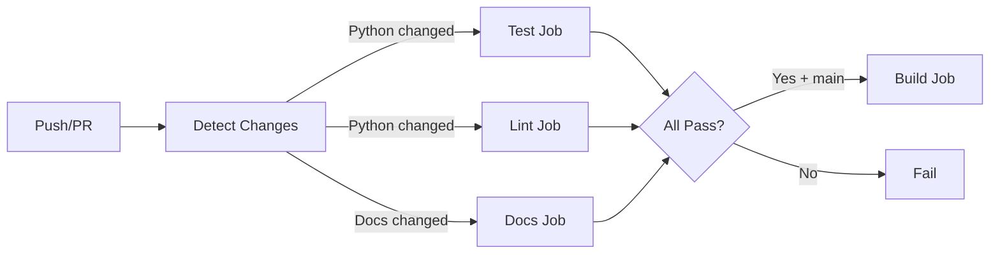

# CI/CD Pipeline

PersonaMate uses GitHub Actions for automated testing, code quality enforcement, and continuous integration.

## Pipeline Overview

The CI/CD pipeline runs on every push and pull request to `main` and `dev` branches. Jobs are executed conditionally based on which files changed, improving efficiency.



### Conditional Execution

Jobs run only when relevant files change:

| Job | Triggers On |
|-----|-------------|
| **test** | `src/python/**`, `test/python/**`, `requirements.txt`, `docker-compose.yml`, `Dockerfile` |
| **lint** | `src/python/**`, `test/python/**` |
| **docs** | `docs/**`, `mkdocs.yml`, `README.md` |
| **build** | Always runs on `main` after all jobs pass/skip |

**Benefits:**
- ⚡ Faster CI runs (skip irrelevant jobs)
- 💰 Reduced GitHub Actions minutes
- 🎯 Clear feedback on what changed
- ✅ Still runs all jobs on pull requests

**Force run all jobs:**
- Create a pull request (always runs everything)
- Push to `main` branch (runs build job)
- Modify `.github/workflows/` (triggers all)

## Pipeline Jobs

### 1. 🧪 Test Job

Runs all automated tests in a Docker environment to validate functionality.

**What it does:**
- Starts Neo4j database
- Starts MCP server using FastMCP
- Runs MCP integration tests (6 tests)
- Runs tool implementation tests (14 tests)
- Generates code coverage report
- Uploads coverage to Codecov

**Test suites:**
- **MCP Integration Tests**: Validates MCP server initialization, tool listing, resource reading, and protocol compliance
- **Tool Implementation Tests**: Tests all CRUD operations for persons and relationships, including cross-tool workflows

**Requirements:**
- Neo4j service must be running
- MCP server must be started before integration tests
- Environment variables from GitHub Secrets (`OPENAI_API_KEY`)

**Test execution:**
```yaml
- name: Run MCP integration tests
  run: docker compose run --rm pytest pytest /app/test/python/test_mcp_integration.py -v

- name: Run tool tests
  run: docker compose run --rm pytest pytest /app/test/python/test_tools.py -v

- name: Run all tests with coverage
  run: docker compose run --rm pytest pytest /app/test/python/ --cov=/app/src/python --cov-branch --cov-report=xml --cov-report=term -v

- name: Upload coverage to Codecov
  uses: codecov/codecov-action@v4
  with:
    file: ./coverage.xml
    token: ${{ secrets.CODECOV_TOKEN }}
```

**Coverage reporting:**
- Uses `pytest-cov` for coverage collection
- Includes branch coverage with `--cov-branch`
- Generates XML report for Codecov
- Uploads to [codecov.io](https://codecov.io) for tracking
- Badge available in README

### 2. 💅 Lint Job

Enforces code quality and automatically formats code using black.

**What it does:**
- Checks for syntax errors using flake8
- Auto-formats Python code with black (120 char line length)
- Commits formatting changes on push events (with `[skip ci]` tag)
- Shows formatting preview on pull requests (no commit)

**Auto-formatting behavior:**

=== "On Push"
    ```yaml
    - name: Format with black
      run: black src/python test/python --line-length=120

    - name: Commit changes
      run: |
        git config user.name "github-actions[bot]"
        git config user.email "github-actions[bot]@users.noreply.github.com"
        git add -A
        git diff-index --quiet HEAD || git commit -m "style: auto-format code with black [skip ci]"
        git push
    ```

=== "On Pull Request"
    ```yaml
    - name: Format with black
      run: black src/python test/python --line-length=120 --check --diff
    ```

**Formatting rules:**
- Line length: 120 characters
- Style: Black default (PEP 8 compliant)
- Import sorting: isort with black profile
- Trailing whitespace removed
- Single newline at end of file

### 3. 📚 Docs Job

Validates documentation builds correctly with no broken links.

**What it does:**
- Installs MkDocs with Material theme
- Builds documentation with strict mode
- Fails if any broken links or errors found
- Verifies site structure

**Build steps:**
```yaml
- name: Install MkDocs dependencies
  run: pip install mkdocs mkdocs-material mkdocs-git-revision-date-localized-plugin

- name: Build documentation
  run: mkdocs build --strict
```

**Validation:**
- `--strict` flag ensures build fails on warnings
- Catches broken internal links
- Validates navigation structure
- Checks for missing files

### 4. 🏗️ Build Job

Validates deployment readiness (only runs on `main` branch after tests pass).

**What it does:**
- Builds Docker images
- Starts all services (Neo4j, MCP, OpenWebUI)
- Performs smoke test
- Validates deployment configuration

**Build steps:**
```yaml
- name: Build services
  run: docker compose build

- name: Start services
  run: docker compose up -d

- name: Validate deployment
  run: docker compose ps
```

## Required GitHub Secrets

Configure these secrets in your repository settings:

| Secret | Purpose | Required |
|--------|---------|----------|
| `OPENAI_API_KEY` | OpenAI API key for LLM functionality | Yes |
| `CODECOV_TOKEN` | Codecov upload token for coverage reports | Yes |
| `LANGCHAIN_API_KEY` | LangChain tracing API key | Optional |

**How to add secrets:**
1. Go to repository `Settings`
2. Navigate to `Secrets and variables` → `Actions`
3. Click `New repository secret`
4. Add name and value

## Local Development Workflow

### Running Tests Locally

Match the CI environment by using Docker:

```bash
# Start services
docker compose up -d neo4j mcp

# Wait for initialization
sleep 15

# Run MCP integration tests
docker compose run --rm pytest pytest /app/test/python/test_mcp_integration.py -v

# Run tool tests
docker compose run --rm pytest pytest /app/test/python/test_tools.py -v

# Run all tests with coverage (including branch coverage)
docker compose run --rm pytest pytest /app/test/python/ --cov=/app/src/python --cov-branch --cov-report=xml --cov-report=term -v

# View coverage report
cat coverage.xml
```

**Setup Codecov locally:**
```bash
# Install codecov CLI (optional)
pip install codecov

# Upload coverage manually
codecov -t YOUR_CODECOV_TOKEN
```

### Code Formatting Locally

#### Option 1: Pre-commit Hooks (Recommended)

Install pre-commit hooks for automatic formatting:

```bash
# Install pre-commit
pip install pre-commit

# Install git hooks
pre-commit install

# Now hooks run automatically on git commit!
```

Pre-commit will:
- Format code with black
- Sort imports with isort
- Check with flake8
- Remove trailing whitespace
- Ensure single newline at end of file

#### Option 2: Manual Formatting

Format code manually before committing:

```bash
# Format all Python files
black src/python test/python --line-length=120

# Check what would be formatted (without changing files)
black src/python test/python --line-length=120 --check

# Run all pre-commit hooks manually
pre-commit run --all-files
```

## Workflow Triggers

The pipeline uses path-based filtering for efficient execution:

```yaml
on:
  push:
    branches: [ main, dev ]
  pull_request:
    branches: [ main, dev ]

jobs:
  changes:
    # Detects which files changed
    outputs:
      python: ${{ steps.filter.outputs.python }}
      docs: ${{ steps.filter.outputs.docs }}
      docker: ${{ steps.filter.outputs.docker }}
```

**Path filters:**
```yaml
filters:
  python:
    - 'src/python/**'
    - 'test/python/**'
    - 'requirements.txt'
  docs:
    - 'docs/**'
    - 'mkdocs.yml'
    - 'README.md'
  docker:
    - 'docker-compose.yml'
    - 'Dockerfile'
```

**Behavior:**
- **Push to main/dev**: Runs jobs based on changed files
- **Pull request**: Runs all jobs for complete validation
- **Build job**: Only runs on `main` branch pushes after all jobs pass

## Status Badges

Track pipeline status with badges:

```markdown

[](https://codecov.io/gh/enrodrigu/PersonaMate)
```

## Troubleshooting

### Tests Fail in CI but Pass Locally

**Cause**: Environment differences between local and CI

**Solution:**
- Use Docker locally: `docker compose run --rm pytest pytest /app/test/python/ -v`
- Check GitHub Secrets are set correctly
- Ensure MCP server starts before integration tests

### Auto-format Creates Unnecessary Commits

**Cause**: Code not formatted before push

**Solution:**
- Install pre-commit hooks: `pre-commit install`
- Format manually before commit: `black src/python test/python --line-length=120`

### Build Job Fails

**Cause**: Only runs on `main` branch

**Solution:**
- Build job is expected to be skipped on non-main branches
- Test locally with: `docker compose build && docker compose up -d`

### Coverage Report Missing

**Cause**: Tests failed or coverage upload failed

**Solution:**
- Check test job logs for failures
- Verify Codecov integration is enabled
- Ensure coverage is generated: `--cov=/app/src/python --cov-report=term`

## Next Steps

- **[Testing Guide →](testing.md)** Learn how to write and run tests
- **[Contributing Guide →](contributing.md)** Start contributing to PersonaMate
- **[Project Structure →](structure.md)** Understand the codebase organization
